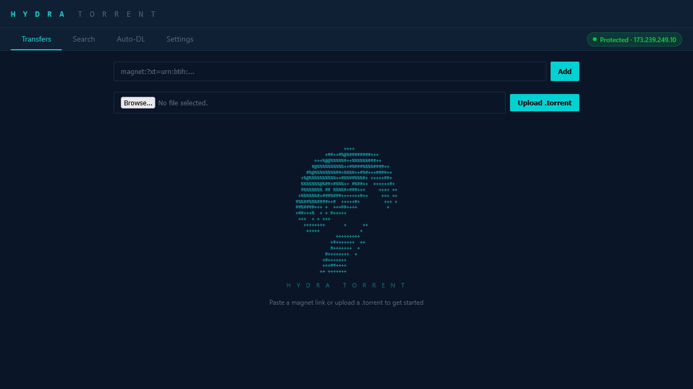
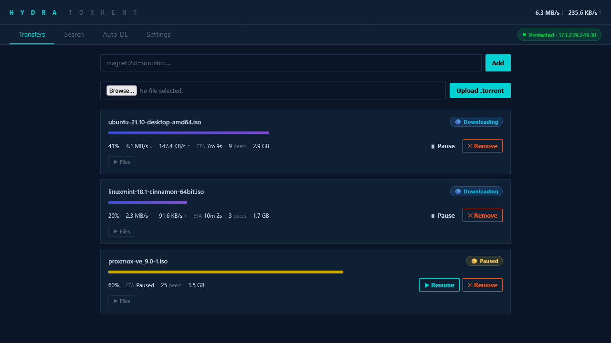
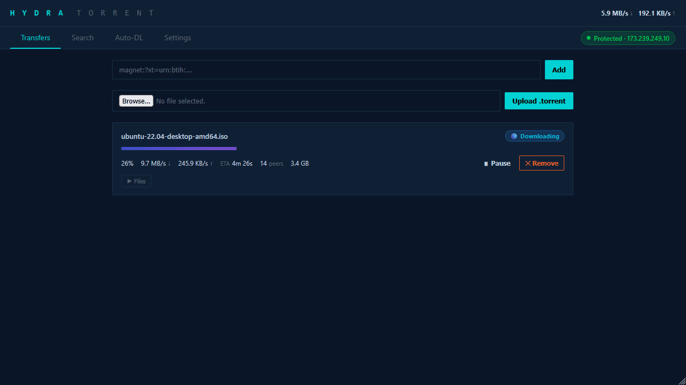
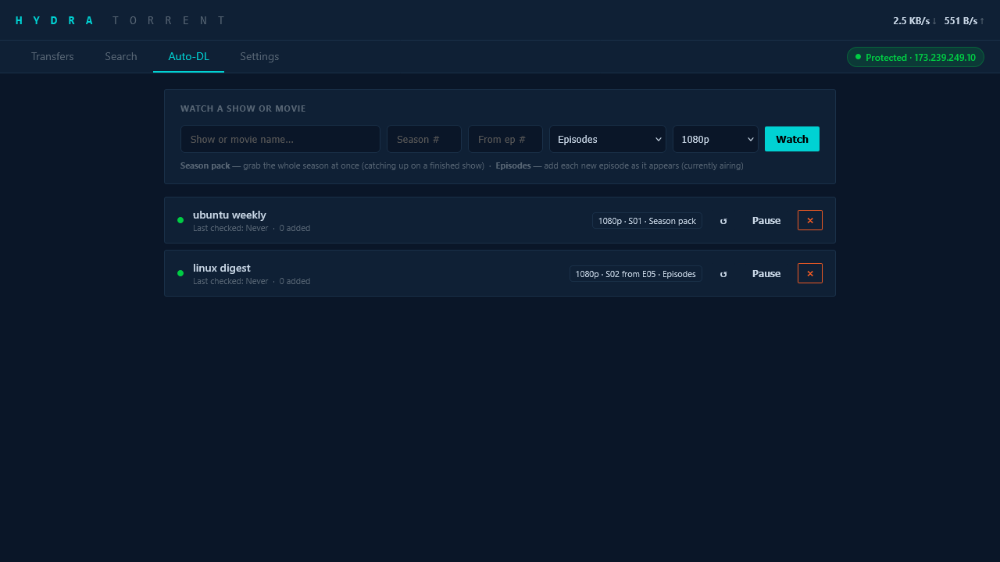
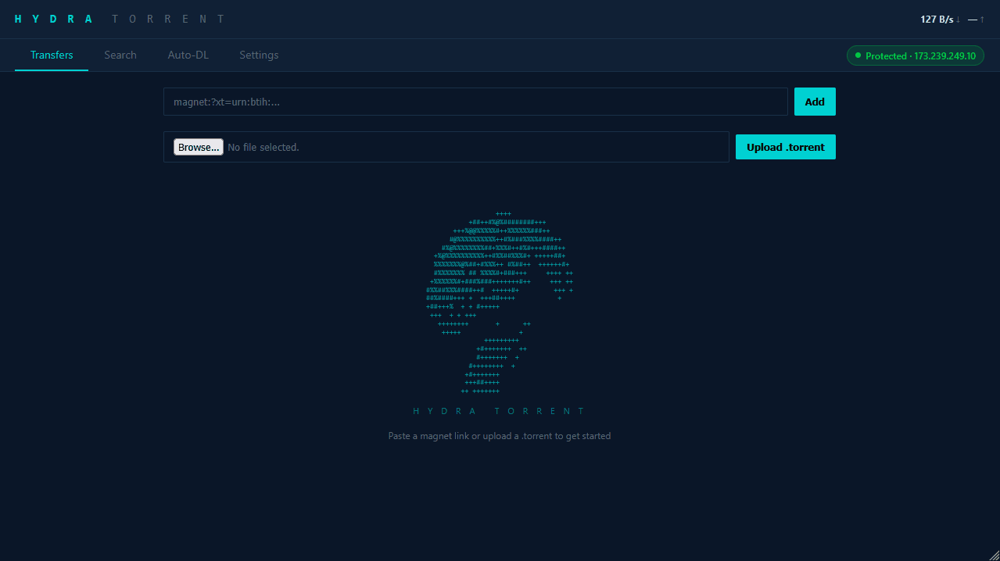
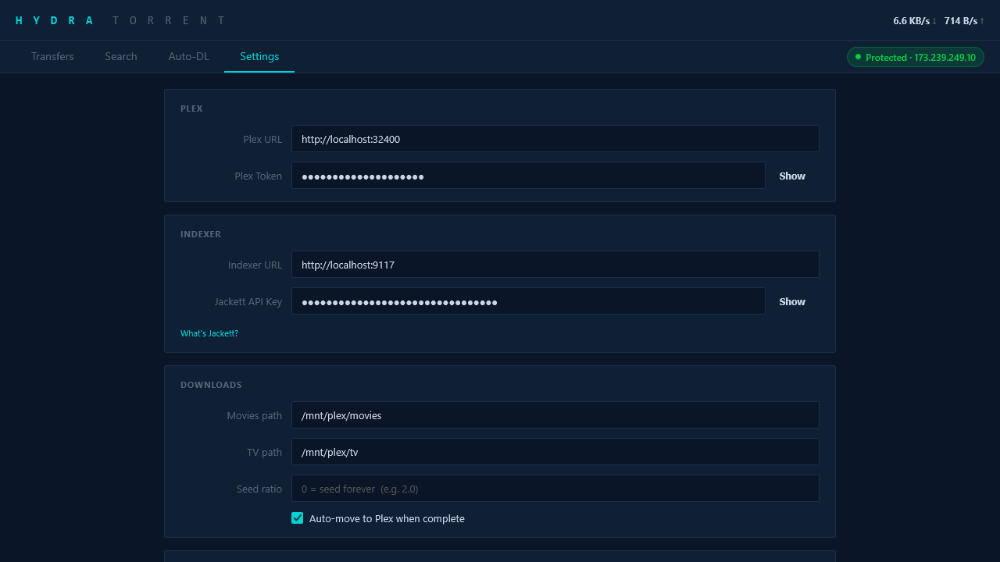
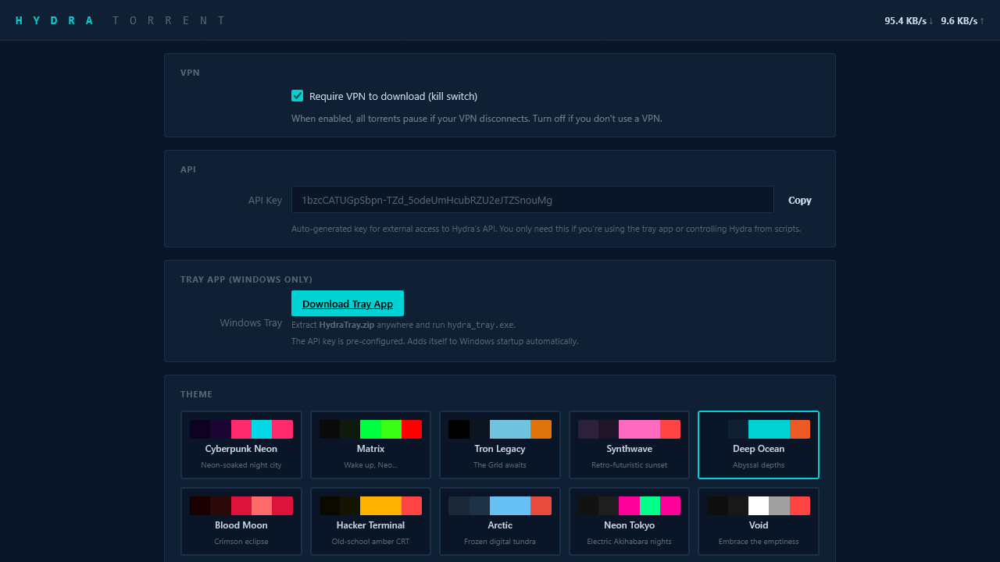

# Hydra Torrent

**A torrent client that actually protects your IP.** Auto-sorts to Plex, grabs new episodes automatically, and replaces your entire qBittorrent + Sonarr + Radarr stack.

## Install

### Windows
**[>>> Download for Windows <<<](https://github.com/DelCtrlAlt33/hydra-torrent/releases/latest/download/HydraTorrent-Windows.zip)**

Extract the zip, double-click `HydraTorrent.exe`. It self-installs on first run — desktop shortcut, Start Menu entry, system tray icon. No Python, no dependencies, no terminal.

### Docker
```bash
git clone https://github.com/DelCtrlAlt33/hydra-torrent.git
cd hydra-torrent
docker compose up -d
```
Edit `docker-compose.yml` to set your media volumes and VPN. Config is stored in `./data/`.

### Linux (Ubuntu, Debian, LXC, VM, bare metal)
```bash
git clone https://github.com/DelCtrlAlt33/hydra-torrent.git
cd hydra-torrent
sudo bash install.sh
```
Installs dependencies, creates a system user, registers a systemd service, and starts Hydra. Prints the URL when done.

### Manual (any OS with Python 3.10+)
```bash
git clone https://github.com/DelCtrlAlt33/hydra-torrent.git
cd hydra-torrent
pip install -r requirements.txt
python hydra_daemon.py
```
Open `http://127.0.0.1:8765/ui` in your browser.

---

**Everything works out of the box as a torrent client.** A config file is created automatically. Add Plex, Jackett, VPN whenever you want — all optional.

---





## Why Hydra?

**Your VPN drops. qBittorrent keeps downloading on your real IP.** Hydra doesn't. It auto-detects your VPN (any provider — WireGuard, OpenVPN, NordVPN, Mullvad, PIA, whatever), binds to it, and if the VPN goes down — every torrent pauses instantly. When it reconnects, they resume. Zero config, zero leaks.



**A download finishes. Now you have to move it, rename it, figure out if it's a movie or TV show, put it in the right Plex folder, and trigger a library scan.** Hydra does all of that automatically. It detects movies vs TV vs anime, files it into the right folder, and tells Plex to scan. Download finishes → it's in Plex. Done.

**You want new episodes of a show grabbed automatically.** Set up a rule with the show name, season, and quality — Hydra checks for new releases and downloads them as they drop. No Sonarr, no Radarr, no Prowlarr, no Docker compose with 5 containers.



**Search and download in seconds.** Search public indexers or your own Jackett instance, click a result, and it starts downloading.



**It's one Python script and one config file.** That's the whole stack.

## Features

- Browser UI from any device on your network (phone, laptop, whatever)
- Search torrents directly from the UI (public indexers or Jackett)
- VPN kill switch — optional toggle to block all downloads without VPN
- Pick which files to download from a torrent — skip the extras
- Seed ratio limits with auto-remove
- RSS rules that grab new episodes as they drop
- Auto-sort to Plex with library scan on completion
- HTTPS with API key auth and rate limiting
- Windows system tray app with toast notifications




### Useful commands (Linux)

```bash
sudo systemctl status hydra-torrent     # check if it's running
sudo systemctl restart hydra-torrent    # restart
sudo journalctl -u hydra-torrent -f     # view logs
```

### Troubleshooting

**`pip install libtorrent` fails?** Make sure you're on Python 3.10–3.13. Older versions don't have prebuilt packages. If you're on Linux and pip doesn't work, try `sudo apt install python3-libtorrent` instead.

**Can't connect?** Hydra runs on port 8765. Make sure nothing else is using that port. Check your firewall if accessing from another device on your network.

## VPN Kill Switch

Enable "Require VPN to download" in Settings and your real IP will never touch a peer or tracker. Hydra binds all torrent traffic directly to your VPN interface — your public IP is never used to download, upload, or connect to anything. If the VPN drops, there's nothing to fall back to. The connection is physically locked to an interface that no longer exists, so nothing can leak. Every download pauses instantly and resumes automatically when the VPN reconnects. This is the same mechanism qBittorrent, Deluge, and Transmission use — it's the industry standard approach, but Hydra does it automatically.

## VPN Setup (optional)

Install your VPN on the same machine Hydra runs on. That's it — Hydra finds it automatically.

It works with WireGuard, OpenVPN, NordVPN, Mullvad, ProtonVPN, ExpressVPN, PIA, Tailscale, Cisco AnyConnect, or anything that creates a `tun`/`tap`/`vpn` network adapter. All torrent traffic binds to the VPN interface. If the VPN drops, every torrent pauses instantly. When it reconnects, they resume.

No configuration needed in Hydra. Just get your VPN running and Hydra handles the rest.

Most VPN providers give you either a WireGuard or OpenVPN config file. Set it up on the machine where Hydra runs and Hydra handles the rest.

### PIA (Private Internet Access)

PIA's WireGuard tokens expire every 24 hours, so you need their official script to auto-reconnect:

```bash
apt install wireguard
git clone https://github.com/pia-foss/manual-connections.git
cd manual-connections
sudo PIA_USER=p1234567 PIA_PASS=your_password \
     VPN_PROTOCOL=wireguard AUTOCONNECT=true \
     PIA_PF=false PIA_DNS=true DISABLE_IPV6=yes \
     DIP_TOKEN=no ./run_setup.sh
```

To keep it running permanently, set up [pia-autoconnect-wireguard](https://github.com/j00w33/pia-autoconnect-wireguard) — it refreshes the token daily via a systemd service + cron job.

### Mullvad / ProtonVPN / NordVPN / Surfshark

These providers give you a static WireGuard config file that doesn't expire. Download it from your provider's website and:

```bash
apt install wireguard
# Save your provider's config as /etc/wireguard/wg0.conf
wg-quick up wg0
systemctl enable wg-quick@wg0   # auto-start on boot
```

### OpenVPN (works with any provider)

```bash
apt install openvpn
# Download your .ovpn file from your VPN provider
cp your-config.ovpn /etc/openvpn/client.conf
systemctl start openvpn@client
systemctl enable openvpn@client   # auto-start on boot
```

Hydra detects the VPN within seconds — check the badge in the top right of the UI.

## Search & Auto-Download (optional)

Hydra searches torrents through [Jackett](https://github.com/Jackett/Jackett) — a free app that connects to hundreds of torrent sites and gives Hydra one place to search them all. If you want search or auto-download rules to work, you need Jackett running somewhere on your network.

1. Install Jackett ([instructions](https://github.com/Jackett/Jackett#installation)) — it runs on Windows, Linux, or Docker
2. Add some indexers (torrent sites) in Jackett's web UI
3. Copy your Jackett API key from the top of Jackett's dashboard
4. In Hydra's Settings tab, paste the Jackett URL (e.g. `http://localhost:9117`) and API key

That's it — the Search tab and Auto-DL rules will work. If you don't use Jackett, everything else still works fine — you just add torrents manually via magnet links or .torrent files.

## Plex (optional)

If you use Plex, Hydra can automatically move completed downloads into your Plex library and trigger a scan.

1. In Hydra's Settings tab, set your **Plex URL** (e.g. `http://localhost:32400`)
2. Set your **Plex Token** — to find it, open any media in Plex web, click "Get Info", click "View XML", and look for `X-Plex-Token=` in the URL ([Plex's guide](https://support.plex.tv/articles/204059436-finding-an-authentication-token-x-plex-token/))
3. Set your **movie and TV folder paths** — these should match the folders your Plex libraries point to. For example:
   - Movies path: `/mnt/media/movies` (or `\\nas\media\movies` on Windows)
   - TV path: `/mnt/media/tv`

When a download finishes, Hydra looks at the filename and figures out what it is:

- Has `S01E05`, `Season 2`, `1x05`, or episode numbers → **TV show** → moves to `TV path/Show Name/Season 01/`
- Has a year like `(2024)` → **Movie** → moves to `Movies path/Movie Name (2024)/`
- Anime with fansub tags like `[SubGroup]` → detected as TV automatically

Plex library scan triggers after every move, so new content shows up in Plex within seconds.

If you don't use Plex, skip this — downloads stay in the downloads directory and you can move them yourself.

## Status

Works. Runs on Docker, bare metal Linux, or Windows. Battle-tested on my homelab, shipping it for yours. Issues and PRs welcome.

## License

MIT
