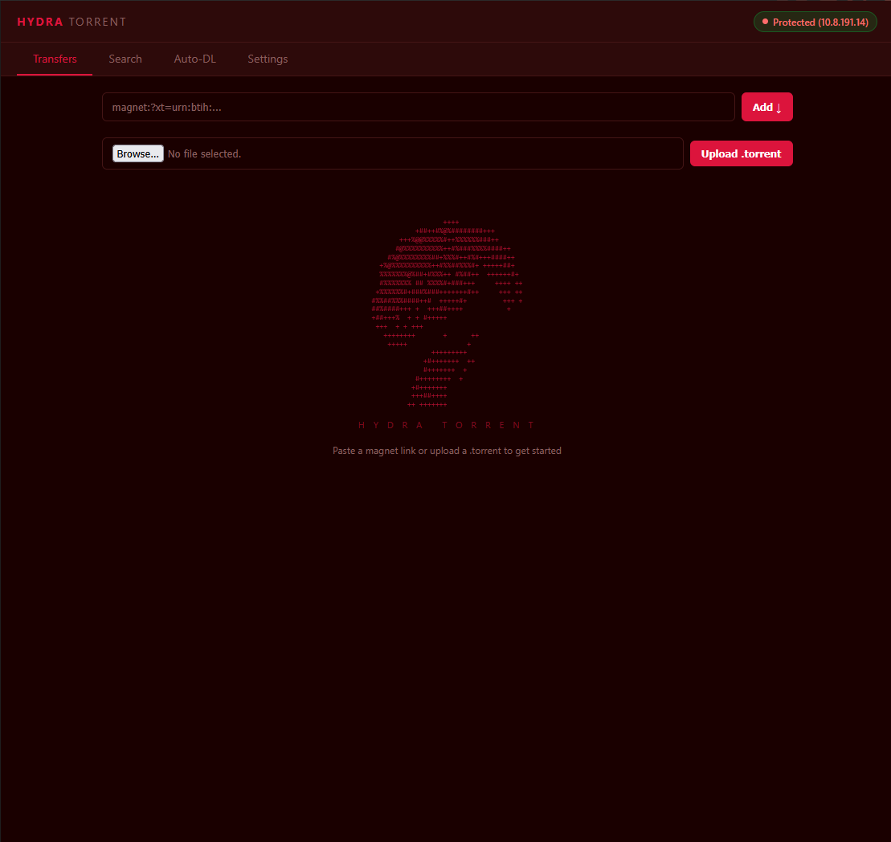
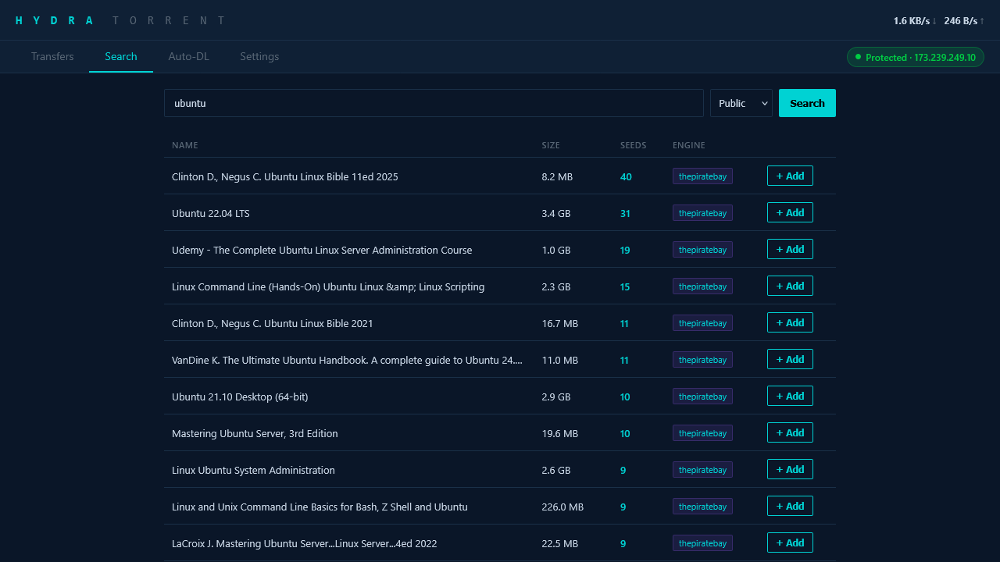

# Hydra Torrent

**One app replaces qBittorrent + Sonarr + Radarr.** Download, auto-sort to Plex, VPN kill switch — no Docker stack required.




## Why Hydra?

**Your VPN drops. qBittorrent keeps downloading on your real IP.** Hydra doesn't. It auto-detects your VPN (any provider — WireGuard, OpenVPN, NordVPN, Mullvad, PIA, whatever), binds to it, and if the VPN goes down — every torrent pauses instantly. When it reconnects, they resume. Zero config, zero leaks.

**A download finishes. Now you have to move it, rename it, figure out if it's a movie or TV show, put it in the right Plex folder, and trigger a library scan.** Hydra does all of that automatically. It detects movies vs TV vs anime, files it into the right folder, and tells Plex to scan. Download finishes → it's in Plex. Done.

**You want new episodes of a show grabbed automatically.** Set up a rule with the show name, season, and quality — Hydra checks for new releases and downloads them as they drop. No Sonarr, no Radarr, no Prowlarr, no Docker compose with 5 containers.

**It's one Python script and one config file.** That's the whole stack.

## What else it does

- Browser UI you can open from any device on your network (phone, laptop, whatever)
- Search torrents directly from the UI via Jackett
- Pick which files to download from a torrent — skip the extras
- Seed ratio limits with auto-remove
- 15 dark themes (Cyberpunk Neon, Matrix, Blood Moon, and more)
- Full REST API with Swagger docs at `/docs`
- Windows system tray app with toast notifications (optional)
- HTTPS with API key auth and rate limiting

## Quick Start

**Requirements:** Python 3.10+ and libtorrent

```bash
git clone https://github.com/DelCtrlAlt33/hydra-torrent.git
cd hydra-torrent
pip install -r requirements.txt
python hydra_daemon.py
```

Open `https://localhost:8765/ui` in your browser. Accept the cert warning (self-signed). That's it — you're running.

A config file (`hydra_config.json`) is created on first run. Everything is optional. It works as a standalone torrent client out of the box. Add Plex, Jackett, VPN whenever you want.

## Run it as a service

```bash
sudo cp hydra-torrent.service /etc/systemd/system/
# Edit the service file to match your install path
sudo systemctl enable --now hydra-torrent
```

Starts on boot, runs in the background.

## VPN (optional)

Hydra auto-detects your VPN — WireGuard, OpenVPN, NordVPN, Mullvad, ProtonVPN, ExpressVPN, PIA, Tailscale, Cisco AnyConnect, or anything with a `tun`/`tap`/`vpn` adapter. No configuration needed. All torrent traffic goes through the VPN. If it drops, everything pauses. When it reconnects, everything resumes.

## Search & Auto-Download (optional)

Hydra searches torrents through [Jackett](https://github.com/Jackett/Jackett) — a free app that connects to hundreds of torrent sites and gives Hydra one place to search them all. If you want search or auto-download rules to work, you need Jackett running somewhere on your network.

1. Install Jackett ([instructions](https://github.com/Jackett/Jackett#installation)) — it runs on Windows, Linux, or Docker
2. Add some indexers (torrent sites) in Jackett's web UI
3. Copy your Jackett API key from the top of Jackett's dashboard
4. In Hydra's Settings tab, paste the Jackett URL (e.g. `http://localhost:9117`) and API key

That's it — the Search tab and Auto-DL rules will work. If you don't use Jackett, everything else still works fine — you just add torrents manually via magnet links or .torrent files.

## Plex (optional)

If you use Plex, Hydra can automatically move completed downloads into your Plex library and trigger a scan.

1. In Hydra's Settings tab, set your **Plex URL** (e.g. `http://localhost:32400`)
2. Set your **Plex Token** — to find it, open any media in Plex web, click "Get Info", click "View XML", and look for `X-Plex-Token=` in the URL ([Plex's guide](https://support.plex.tv/articles/204059436-finding-an-authentication-token-x-plex-token/))
3. Set your **movie and TV folder paths** — these should match the folders your Plex libraries point to. For example:
   - Movies path: `/mnt/media/movies` (or `\\nas\media\movies` on Windows)
   - TV path: `/mnt/media/tv`

When a download finishes, Hydra looks at the filename and figures out what it is:

- Has `S01E05`, `Season 2`, `1x05`, or episode numbers → **TV show** → moves to `TV path/Show Name/Season 01/`
- Has a year like `(2024)` → **Movie** → moves to `Movies path/Movie Name (2024)/`
- Anime with fansub tags like `[SubGroup]` → detected as TV automatically

Plex library scan triggers after every move, so new content shows up in Plex within seconds.

If you don't use Plex, skip this — downloads stay in the downloads directory and you can move them yourself.

## Built with

[libtorrent](https://libtorrent.org/) | [FastAPI](https://fastapi.tiangolo.com/) | [pystray](https://github.com/moses-palmer/pystray)

## Status

Early release — built for my homelab. Works on my setup, might need tweaking on yours. Issues and PRs welcome.

## License

MIT
